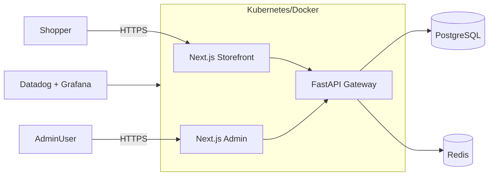

<div align="center">

# NextFind

[](https://github.com/PavanAnganna90/NextFind/actions/workflows/ci.yml)
[](LICENSE)
[](#deployment)
[](https://www.linkedin.com/in/pavananganna90/)

</div>

NextFind is an end-to-end commerce platform with a customer storefront, an analytics-heavy admin console, and production-ready infrastructure automation. It blends Next.js 14, Tailwind, Zustand, FastAPI microservices, PostgreSQL, Redis, and Datadog into a showcase of full-stack, DevOps, and SRE practices that you can deploy locally or to Kubernetes in minutes.

---

## ✨ Feature Highlights
- **Dual Next.js surfaces**: shopper storefront (`apps/client`) and Shadcn-powered admin (`apps/admin`)
- **Robust commerce flows**: wishlist, cart, checkout guards, Stripe-ready payment hooks
- **Performance-minded**: Zustand stores, edge-friendly API routes, image optimization
- **Infrastructure as code**: Docker, Kubernetes manifests, monitoring stack, GitHub Actions CI
- **BMAD Method v6 workflow**: documentation, automation, and story-driven delivery baked in

---

## 🗂 Repository Layout
```
apps/
  apps/client/            # Storefront Next.js app
  apps/admin/             # Admin dashboard Next.js app
services/
  api/               # Backend utilities and scripts
infra/
  docker/            # docker-compose and Dockerfiles
  kubernetes/        # Production-ready manifests & overlays
  monitoring/        # Datadog, Prometheus, Grafana configs
docs/
  architecture.md    # High-level system diagram and flows
  operations.md      # Deploy/runbooks
  troubleshooting.md # Known issues & fixes
.github/
  workflows/ci.yml   # Lint + test pipeline
  ISSUE_TEMPLATE/    # Bug & feature templates
README.md
CHANGELOG.md
CONTRIBUTING.md
LICENSE
```

---

## 🏗 Architecture



See `docs/architecture.md` for sequence diagrams, deployment topologies, and data flow details.

---

## 🚀 Getting Started
1. **Install dependencies**
   ```bash
   pnpm install
   ```
2. **Configure environment**
   ```bash
   cp .env.example .env
   # fill Stripe, Postgres, Redis, and Datadog secrets
   ```
3. **Run local services**
   ```bash
   docker compose -f infra/docker/docker-compose.yml up -d postgres redis
   ```
4. **Start apps**
   ```bash
   pnpm --filter ./apps/admin dev
   pnpm --filter ./apps/client dev
   ```

Applications are served on `http://localhost:3000` (storefront) and `http://localhost:3001` (admin).

---

## 🧰 Useful Scripts

| Command | Description |
| --- | --- |
| `pnpm dev` | Run both apps via Turborepo |
| `pnpm lint` | ESLint + style checks |
| `pnpm test` | Vitest/Playwright suites |
| `pnpm --filter ./apps/client build` | Production build for storefront |
| `pnpm --filter ./apps/admin build` | Production build for admin |
| `docker compose -f infra/docker/docker-compose.yml up` | Full stack (apps + db + redis) |
| `make kube-apply` | Apply manifests to target cluster |

> Complete command reference lives in `docs/operations.md`.

---

## ☁️ Deployment
- **Docker**: `docker compose -f infra/docker/docker-compose.prod.yml up -d`
- **Kubernetes**: apply manifests under `infra/kubernetes/overlays/{dev,prod}`
- **Monitoring**: install Datadog via `infra/monitoring/datadog-values.yaml`

CI validates lint/test for every PR (`.github/workflows/ci.yml`). Production pipelines under `.github/workflows/*` cover multi-cluster deployment scenarios.

---

## 📚 Documentation
- `docs/architecture.md`: component diagrams, data contracts, BMAD roles
- `docs/operations.md`: local + cloud deployment, secrets layout, smoke tests
- `docs/troubleshooting.md`: curated fixes distilled from the internal runbooks

---

## 🗺 Roadmap
- [ ] Product reviews & rating API
- [ ] Storybook component catalog with visual tests
- [ ] Load testing suite + SLO dashboards
- [ ] Headless checkout with Stripe + webhooks

Check `TASK.md` for sprint-level planning and `CHANGELOG.md` for release notes.

---

## 👥 Contributors
| Name | Role |
| --- | --- |
| Pavan Anganna | Creator & Maintainer |

Want to help? Read [CONTRIBUTING.md](CONTRIBUTING.md) and open an issue using the templates in `.github/ISSUE_TEMPLATE/`.

---

## 📄 License
Distributed under the [MIT License](LICENSE). Feel free to fork and adapt with attribution.

---

## ✉️ Connect
- LinkedIn: [@PavanAnganna90](https://www.linkedin.com/in/pavananganna90/)
- Issues/ideas: [GitHub Issues](https://github.com/PavanAnganna90/NextFind/issues)

If this repo helps you learn or ship faster, ⭐️ the project and share it on LinkedIn!
